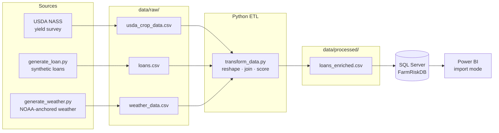

# 🌽 Farm Loan Risk Analytics

A practice data pipeline project that enriches a synthetic farm-loan portfolio with public USDA yield data and synthetic climate data, then assigns each loan a composite risk score.

## What it does

1. **Extract** — three CSVs in `data/raw/`:
   - `loans.csv` — synthetic portfolio (1,000 rows) generated by `etl/generate_loan.py`
   - `usda_crop_data.csv` — USDA NASS yield survey (long format, real data)
   - `weather_data.csv` — synthetic annual weather anchored to 1991–2020 NOAA climate normals, generated by `etl/generate_weather.py`

2. **Transform** (`etl/transform_data.py`) — reshape the USDA long-format survey into tidy `(state, year, crop_type, yield)`, map state full-names to 2-letter codes, collapse multi-year crop/weather history into a per-`(state, crop_type)` baseline (avoids fan-out when joining to loans), and compute a normalized risk score.

3. **Load** — write the enriched portfolio to `data/processed/loans_enriched.csv`, then import into SQL Server for Power BI to consume.

## Layout

```
data/
  raw/          # inputs (loans, USDA, weather)
  processed/    # enriched output
etl/
  generate_loan.py     # synthetic loans
  generate_weather.py  # synthetic weather
  transform_data.py    # ETL pipeline
```

## Architecture



## Run

```bash
py -m venv venv
venv\Scripts\activate
pip install -r requirements.txt

py etl/main.py
```

## Risk model

Each loan receives a `risk_score` (0–100) from four normalized factors, then bucketed into `Low` / `Moderate` / `High`:

| Factor        | Weight | Rationale                             |
| ------------- | -----: | ------------------------------------- |
| LTV           |   0.40 | Direct collateral exposure            |
| Interest rate |   0.20 | Signals borrower credit profile       |
| Yield (inv.)  |   0.20 | Low-yield regions have revenue stress |
| Drought ratio |   0.20 | Climate risk frequency                |

## Dashboard

Built in Power BI against `data/processed/loans_enriched.csv`. Source file: [Dashboard.pbix](dashboard/Dashboard.pbix).

- [Full portfolio view](dashboard/Dashboard.pdf) — unfiltered across all states and crops
- [Drill-down: low-risk cotton in Texas](dashboard/Dashboard_Cotton_Texas_LowRisk.pdf)
