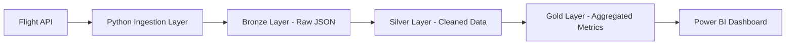

# ✈️ Flight Data Engineering Pipeline

## 📌 Overview

This project is an end-to-end **data engineering pipeline** that ingests, processes, and analyzes flight data from a public aviation API.

The system demonstrates modern data engineering practices using:

- Python (API ingestion)
- Databricks + PySpark (distributed processing)
- Delta Lake (ACID data lakehouse)
- Azure Blob Storage (data lake)
- Power BI (analytics & visualization)

---

## 🎯 Purpose

This project was built to simulate a **real-world data platform** that:

- Ingests external API data reliably
- Processes and cleans large datasets
- Implements a **medallion architecture (Bronze/Silver/Gold)**
- Supports **incremental data loads**
- Enables business insights through analytics

---

## 🧱 Architecture

### High-Level Flow



---

### Medallion Architecture

| Layer  | Description                       |
| ------ | --------------------------------- |
| Bronze | Raw API data (JSON, unmodified)   |
| Silver | Cleaned, normalized, deduplicated |
| Gold   | Aggregated, analytics-ready       |

---

## ⚙️ Tech Stack

| Component     | Technology                          |
| ------------- | ----------------------------------- |
| Ingestion     | Python                              |
| Processing    | Databricks (PySpark)                |
| Storage       | Azure Blob Storage / Delta Lake     |
| Orchestration | Databricks Jobs (optional: Airflow) |
| Visualization | Power BI                            |

---

## 🏗️ Infrastructure Setup

1. Azure Setup

- Create Storage Account
- Create containers:
  - `bronze`
  - `silver`
  - `gold`

2. Databricks Setup

- Create workspace
- Configure cluster
- Mount Blob Storage

3. API Access

- Register for aviation API key
- Store key securely (env vars / secrets)

---

## 🔁 Data Flow Details

### Ingestion (Python)

- Calls API on schedule
- Handles pagination + retries
- Writes raw JSON to Bronze layer
- Adds ingestion timestamp

---

### Transformation (Databricks)

- Bronze → Silver
  - Flatten JSON
  - Normalize schema
  - Handle nulls
  - Deduplicate records
- Silver → Gold
  - Aggregate metrics:
    - Flights per day
    - Delay rates
    - On-time performance

---

### Incremental Processing

- Track last ingestion timestamp
- Only ingest new data
- Use Delta Lake MERGE for upserts

---

## 📊 Analytics (Power BI)

Dashboard includes:

- ✈️ Flights per day
- ⏱ ️ Delay trends
- 📍 Airport performance
- 📉 On-time percentage

---

## 🧠 Key Features

- Incremental ETL pipeline
- Medallion architecture
- Data quality checks
- Scalable storage (Delta Lake)
- Real-world API ingestion
- Analytics-ready data modeling

---

## 🚀 Future Improvements

- Streaming ingestion (real-time data)
- Airflow orchestration
- Weather data enrichment
- REST API layer for data access
- CI/CD pipeline for deployment

---

## 📂 Repository Structure

```
flight-data-pipeline/
│
├── ingestion/
│ ├── api_client.py
│ ├── ingest.py
│
├── databricks/
│ ├── bronze_to_silver.py
│ ├── silver_to_gold.py
│
├── data/
│ ├── bronze/
│ ├── silver/
│ ├── gold/
│
├── dashboard/
│ └── powerbi.pbix
│
├── TODO.md
└── README.md
```

---

## 🧪 How to Run (Local Dev)

1. Clone repo
2. Set environment variables:

```bash
export API_KEY=your_key
```

3. Run ingestion:

```bash
python ingestion/ingest.py
```

---

## 📌 Takeaways

This project demonstrates the ability to:

- Build scalable data pipelines
- Work with distributed systems
- Model data for analytics
- Deliver business insights
